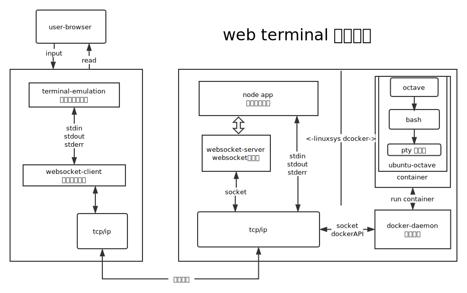

#WebTerminal设计与实践
简介：
    WebTerminal 是一个基于hterm前端终端， websocket网页实时通信， 容器化运行shell的 实时高效安全的在线命令行，毫秒级创建运行容器并建立安全的socket连接，提供完美的用户体验，让在线版的octave 软件可以在任意一台电脑上无需安装即可使用。

Terminal 是键盘和显示器的组合，也称为 TTY（电传打字机的缩写）,Terminal 作为真实的物理设备已经不复存在了，但是为了和面向终端的程序（比如Bash）进行通信，于是就了发明了 pty（Pseudoterminal，伪终端）。当 Terminal Emulator 作为一个非面向终端的程序不直接与 pty slave 通讯，而是通过文件读写流与 pty master 通讯，pty master 再将字符输入经过线路规程的转换传送给 slave，slave 进一步传递给 bash。
关于命令行我们平时最常见就是 使用 ssh 远程登录服务器
SSH 的原理图

SSH 是一个基于的 server-client 的架构，用户通过终端将字符流传递给 SSH client。SSH client 和 SSH server 之间通过 TCP/IP 协议进行通讯。远端的 server 创建一对 pty，并且fork+exec 一个 bash 进程，server 进程通过 pty 对与 bash 进行交互。

基于 SSH 的工作原理，设计了 Web Terminal，见下图

原理框图：

WebTerminal 工作流程：
1.  用户在浏览器中打开终端页面，系统自动建立连接
2.  调用 浏览器 websocket client （js调用的是 socket.io)
3.  tcp/ip 三次握手, 与服务端建立 socket 链接,socket 服务器开始接受前端传送的数据
4.  node APP 通过 docker daemon 的 api 接口创建 容器
5.  容器启动, 载入 ubuntu-octave 镜像  , 并运行 octave 命令
6.  octave 是输出通过到系统的 io中,  容器捕捉到系统的输出之后, 通过 docker daemon 的 httpserver 发送到 node 后台, 
7.  node 把 容器传输的运行结果数据 调用 socket 的 emit() 方法发送到浏览器前端.
8.  前端接收到数据 , 传入hterm 前端的 Terminal Emulator 展示

