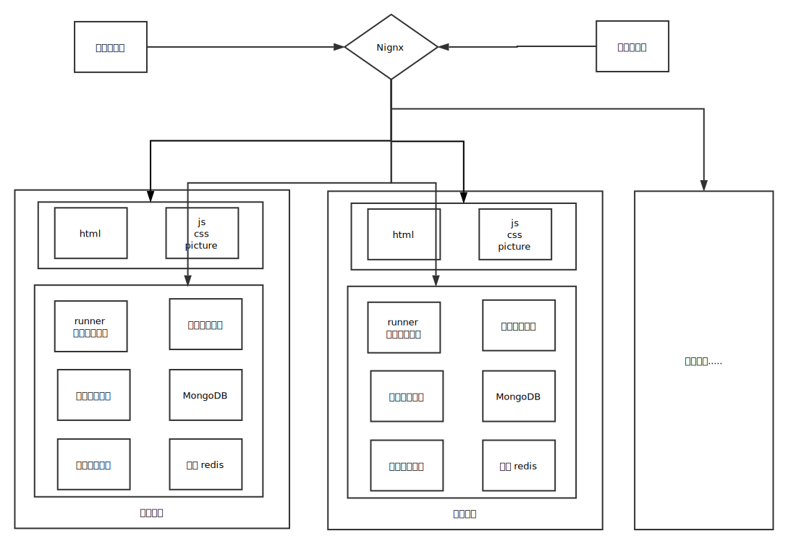

#第五章: 后台架构设计
##Nignx (负载均衡,动静分离):
Nginx("engine x")是一款是由俄罗斯的程序设计师Igor Sysoev所开发高性能的 Web和 反向代理 服务器
在本系统中主要负责 负载均衡,动静分离
具体的功能框图如下:

 

###负载均衡:
nginx反向代理其实主要通过配置proxy_pass参数即可代理到某个服务器
添加如下配置即可：

``` 
vim /usr/local/nginx/conf/nginx.conf
location /api {  
            // 将不同路径的请求代理到不同的微服务中去.
            proxy_pass http://127.0.0.1:8080
        }

```
###动静分离:
动静分离将网站静态资源（HTML，JavaScript，CSS，img等文件）与后台应用分开部署，提高用户访问静态代码的速度，降低对后台应用访问。这里我们将静态资源放到nginx中，动态资源转发到各个容器服务中。
在动静分离的过程中, 只需要将静态资源剥离出来即可:

```
//静态资源    
 location /dist/ { 
            //静态资源到nginx服务器下dist (前端编译出的目录文件)
            alias /data/release/simulay-front/dist/
        }

```

##基于nodeJS express 的后台管理系统

Express 是一种保持最低程度规模的灵活 Node.js Web 应用程序框架，为 Web 和移动应用程序提供一组强大的功能。

与传统的后台 架构不同的是, simulay 整个系统都是基于前后端分离模式的, 后端只需要做一件事: 以 api 的形式对外提供服务能力.
一般的后端管理系统都是一个 mvc 设计模式, 分为三层: view(视图层)-controller(业务逻辑)-model(数据模型层), 而在simulay 的系统后台中, 没有 view 层,取而代之的是 router(路由层), controller 从 model 取得数据之后,直接 encode 成 json 的数据包返回到前端的 spa(单页应用)中去. 
在 simulay 后台中, 主要分为  router - controller- model :

router: 路由层, 顾名思义,将不同地址的请求导航到 不同的 controller 中处理请求

controller: 控制层, 又名服务层, 主要 处理当前请求的业务逻辑, 负责读取请求参数, 发起数据查询请求,筛选组装查询结果, 封装 response 返回包. 

model: 模型层, 底层的数据库都是由不同的表组成的,比如(用户表, 实验表, 仿真记录表等), 如何读取这些数据呢, 如果是用sql 语句的话效率很低, 这里使用了 mongoose 这个 ORM 对象模型连接器, 也即是数据库中的数据映射到 程序中的对象, 直接调用对象方法获取数据即可,把数据库连接 sql 查询等操作做一步封装. 简化代码.  


##websocket 通信


在 webTerminal 中 提到多次 websocket 这个概念. 首先解释一下它是什么,
    
    WebSocket一种在单个 TCP 连接上进行全双工通讯的协议。WebSocket通信协议于2011年被IETF定为标准RFC 6455，并被RFC7936所补充规范。WebSocket API也被W3C定为标准。

    它使得客户端和服务器之间的数据交换变得更加简单，允许服务端主动向客户端推送数据。在 WebSocket API 中，浏览器和服务器只需要完成一次握手，两者之间就直接可以创建持久性的连接，并进行双向数据传输。    


####WebSocket有以下特点：

    是真正的全双工方式，建立连接后客户端与服务器端是完全平等的，可以互相主动请求。而HTTP长连接基于HTTP，是传统的客户端对服务器发起请求的模式。
    HTTP长连接中，每次数据交换除了真正的数据部分外，服务器和客户端还要大量交换HTTP header，信息交换效率很低。Websocket协议通过第一个request建立了TCP连接之后，之后交换的数据都不需要发送 HTTP header就能交换数据，这显然和原有的HTTP协议有区别所以它需要对服务器和客户端都进行升级才能实现（主流浏览器都已支持HTML5）。此外还有 multiplexing、不同的URL可以复用同一个WebSocket连接等功能。这些都是HTTP长连接不能做到的。


####性能测试:

在 WebTerminal 中,  如果使用 XHR Polling (传统浏览器中 AJAX
请求,目前大部分网站前端的请求都是以这种形式发起)的话, 将平均带来几百倍的请求量消耗而且这大部门的请求都是无效的 ping 请求,
具体的区别可以看下面的测试图:


其中Ops/sec  是指请求次数与总耗时之比放大1000倍,可以理解为平均请求时间, 可以看出来websocket 比传统的 xhr 请求快了三倍,同时, 只建立一条 tcp/ip 连接, 对网络资源占用是 xhr  1/N(实验次数)


